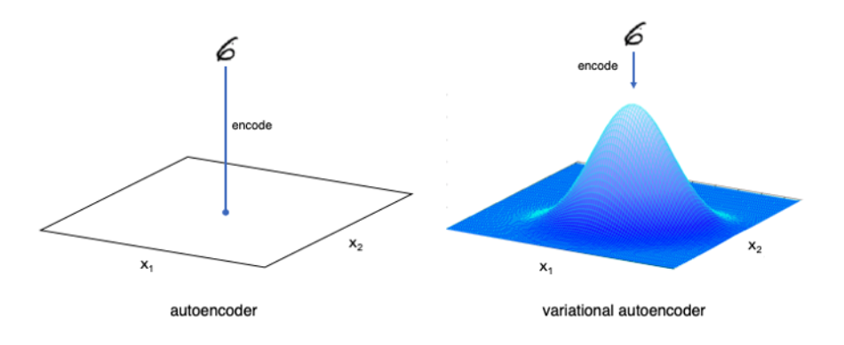
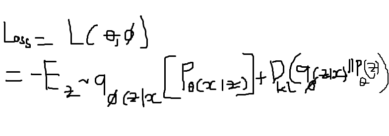
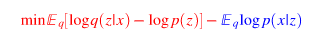
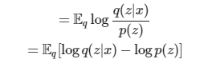

## VAE
>* VAE là một trình mã tự động có phân phối mã hóa được quy định hóa trong quá trình đào tạo để đảm bảo rằng không gian ẩn của nó có các thuộc tính tốt cho phép ta tạo một số dữ liệu mới. Hơn nữa, thuật ngữ “variational” xuất phát từ mối quan hệ chặt chẽ giữa chính quy hóa và phương pháp suy luận biến thiên trong thống kê
>* Tư tưởng chính của VAE là thay vì tìm một điểm biểu diễn trong không gian ẩn cho một điểm dữ liệu trong không gian gốc, ta sẽ đi tìm một phân phối xác suất cho điểm dữ liệu đó
>* 
## Mục đích VAE
>Đào tạo tổng quát hơn autoencode, tạo ra các mẫu rất giống với đầu vào
## Mô hình
>* 
> 
>* Giả sử VAE là mô hình giống hình đồng hồ cát nằm ngang. Phần encoder là phần bên trái của đồng hồ đây là phần đầu vào, ta chọn một giá trị duy nhất để mô tả từng thuộc tính tiềm ẩn theo các thuật ngữ xác suất và biểu diễn nó dưới dạng một dải giá trị. Sau đó ta sẽ lựa chọn ngẫu nhiên một phân phối xác suất dạng tiềm ẩn để làm vecto đầu vào. Tiếp theo, phần giữa của đồng hồ ta gọi nó là z là một vecto ẩn đã được làm giảm các giá trị và nén để biểu diễn làm đầu vào decoder. Cuối cùng phần bên phải đồng hồ decoder, phần này ta sẽ dùng các tham số như u, sigma để tính hàm loss, phân kỳ và train model.
## Công thức
>* VAE có 4 thành phần chính: encoder, decoder, mu, sigma
```diff
- VAE loss: em ko hiểu sao lại ra công thức dưới ạ
```

```diff
- kl divergence: ???
```



